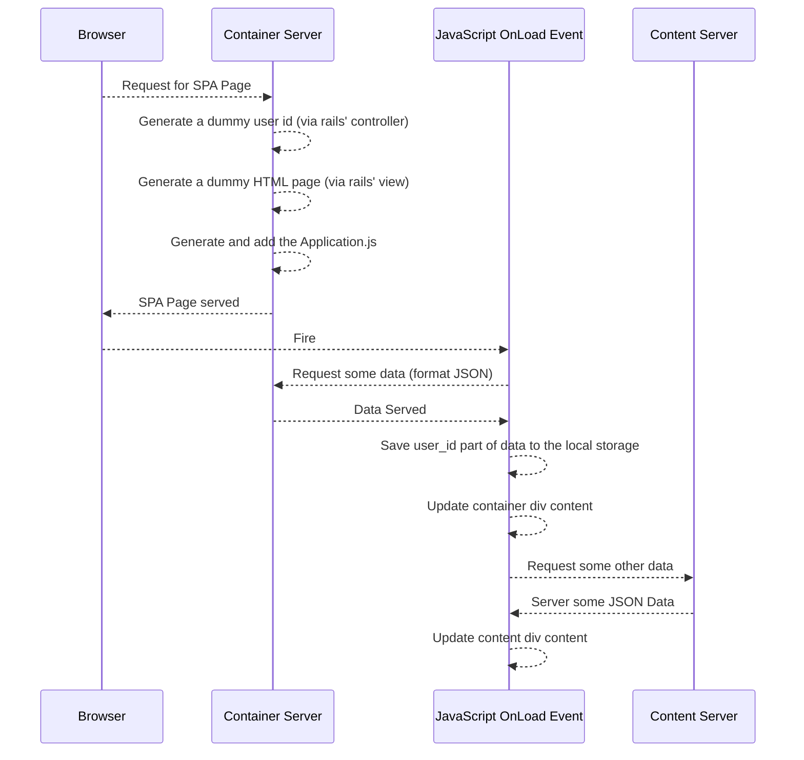

# SPACORSRAILSSample

In this project we'll try to build a  sample architecture consisting of;
	- a container server,
	- a content server,
	- an SPA page
using Ruby on Rails and ReactJS. (ReactJS is not that relevant for our purpose.)

The structure is and the algorithms are like that:




Use the same ```Gemfile``` for both container and content for the sake of simplicity:
```Ruby
gem 'haml'
gem 'haml-rails'
gem 'mysql2', '>= 0.3.18', '< 0.5'
gem 'react-rails'
gem 'react-bootstrap-rails'
```

Rails and React Arrangements for Container Application:
-------------------------------------------------------
```Ruby
cd container/
rails g controller container
```

In the file ```app/assets/javascripts/application.js``` add following lines to include ReactJS support:
```JavaScript
//= require react
//= require react_ujs
//= require react_bootstrap
```
In the directory ```app/assets``` generate a new file named ```main.js``` which will be the main entrance point for our client side codes. And link that file to application by adding following line to our related view:

```haml
= react_component('main')
```

Rails and React Arrangements for Client Application:
-------------------------------------------------------
