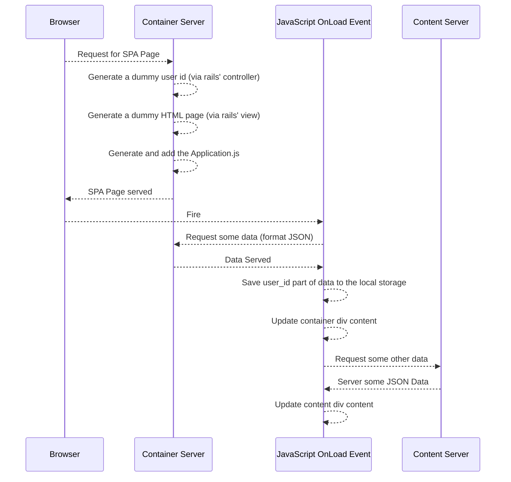

# SPACORSRAILSSample

In this project we'll try to build a  sample architecture consisting of;
	- a container server,
	- a content server,
	- an SPA page.

The structure is and the algorithms are like that:




Use the same ```Gemfile``` for both container and content for the sake of simplicity:
```Ruby
gem 'haml'
gem 'haml-rails'
gem 'mysql2', '>= 0.3.18', '< 0.5'
```