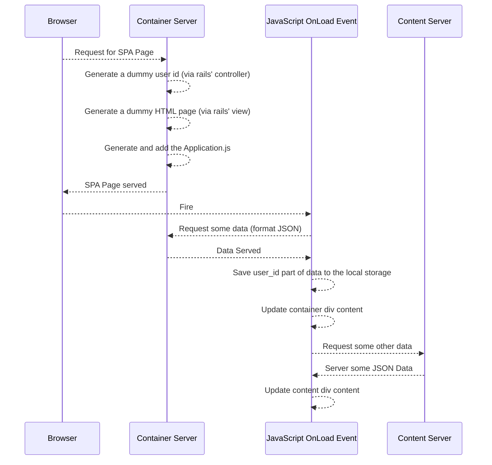

# SPACORSRAILSSample

In this project we'll try to build a  sample architecture consisting of;
	- a container server,
	- a content server,
	- an SPA page
using Ruby on Rails and ReactJS. (ReactJS is not that relevant for our purpose.)

The structure is and the algorithms are like that:




Rails and React Arrangements for Container Application:
-------------------------------------------------------
The newly added gems to ```Gemfile``` are as follows:
```Ruby
gem 'haml'
gem 'haml-rails'
gem 'mysql2', '>= 0.3.18', '< 0.5'
gem 'react-rails'
gem 'react-bootstrap-rails'
```
Do not forget to install the gems.
```Ruby
bundle install
```
Add a controller to serve the container page and also the to serve the request for JSON data:
```Ruby
cd container/
rails g controller container
```

In the directory ```app/assets``` generate a new file named ```main.js``` which will be the main entrance point for our client side codes. Since we need the page first be loaded, will modify the eventhandler:
```JavaScript
window.onload
```

We'll skip request forgery control for only the JSON data post action at container side. The related text that Rails documentation provides is as follows:

[Source.](http://api.rubyonrails.org/classes/ActionController/RequestForgeryProtection.html)...```
We may want to disable CSRF protection for APIs since they are typically designed to be state-less. That is, the request API client will handle the session for you instead of Rails.
...
```


```app/container/controllers/container_controller.rb```:
```Ruby
	skip_before_action :verify_authenticity_token, only: [:datapost]
```

Optional
========

In the file ```app/assets/javascripts/application.js``` add following lines to include ReactJS support:
```JavaScript
//= require react
//= require react_ujs
//= require react_bootstrap
```

In future, if you want to add React components, in view side you can use:
```haml
= react_component('main')
```

Rails and React Arrangements for Client Application:
-------------------------------------------------------
