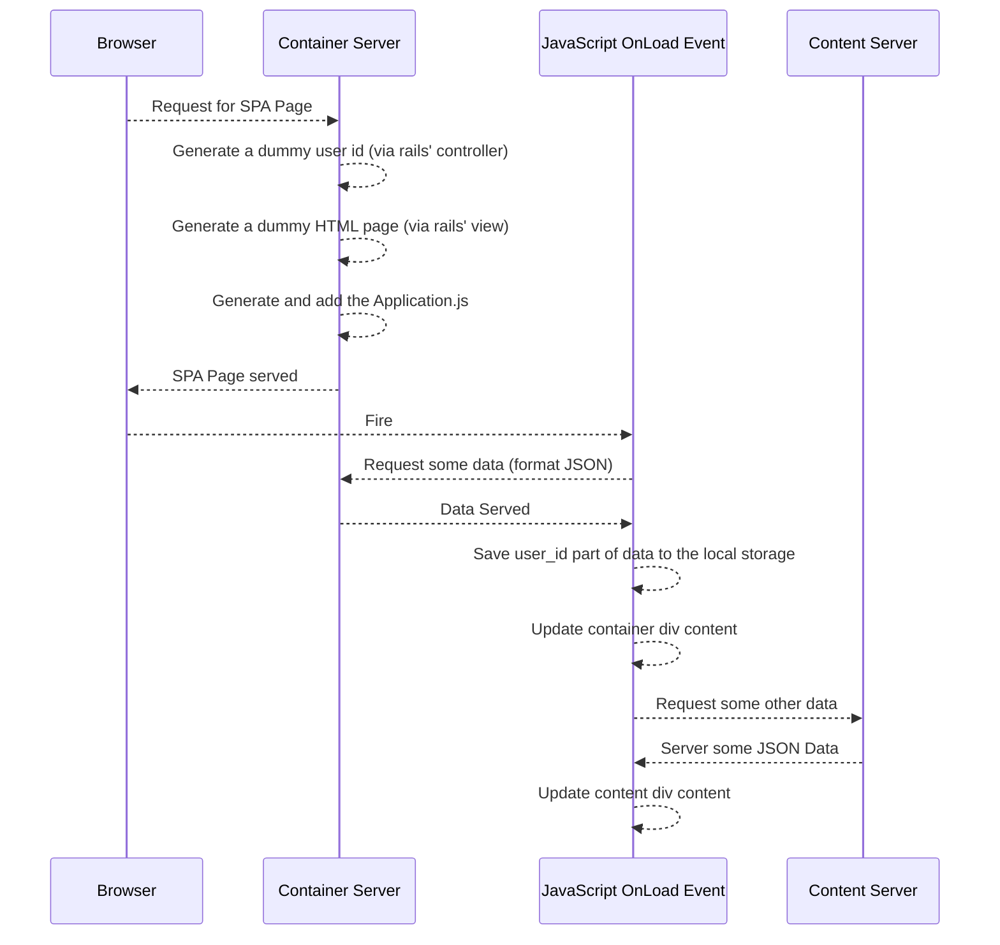
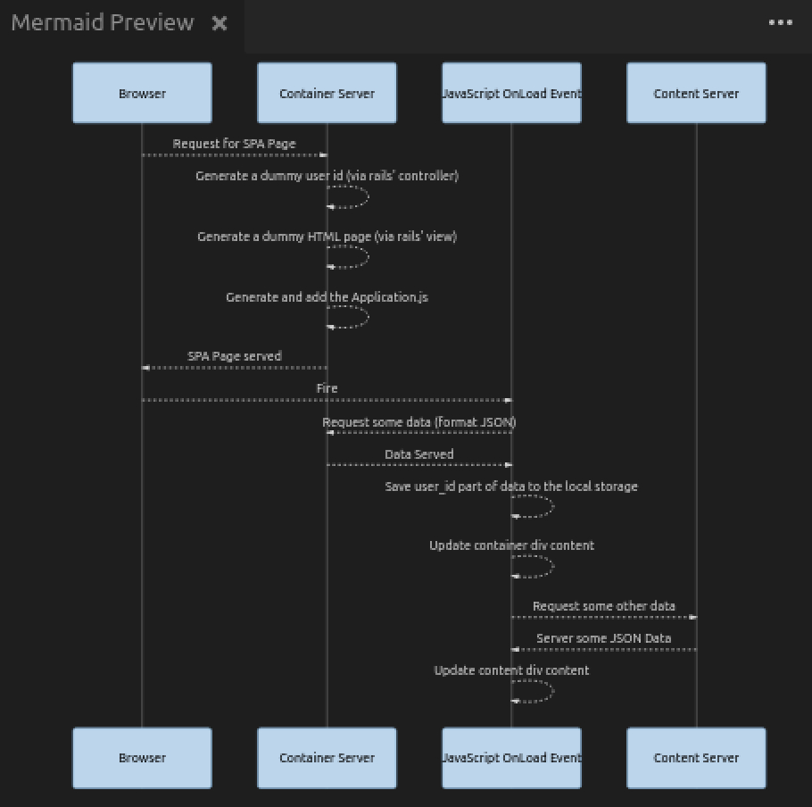

# SPACORSRAILSSample

In this project we'll try to build a  sample architecture consisting of;
- a container API server, (the "container" rails application under this repo)
- a content API server, (the "content" rails application under this repo)
- an SPA page (which is also in the "container" rails application under this repo)
using Ruby on Rails and ReactJS. (ReactJS is not that relevant for our purpose.)

The algorithm is like that:





Rails and React Arrangements for Container Application:
=======================================================
The newly added gems to ```Gemfile``` are as follows:
```Ruby
gem 'haml'
gem 'haml-rails'
gem 'mysql2', '>= 0.3.18', '< 0.5'
gem 'react-rails'
gem 'react-bootstrap-rails'
```
Do not forget to install the gems.
```Ruby
bundle install
```
Add a controller to serve the container page and also the to serve the request for JSON data:
```Ruby
cd container/
rails g controller container
```
We'll have 3 routes. First one is the main container page. The other two are responding API's for the requests that are coming from JavaSciript code of the main container page.

```Ruby
  get '/', :to => 'container#root'
  post '/datapost', :to => 'container#datapost', :constraint => {:format => :json}
  get '/dataget', :to => 'container#dataget'
```
```Ruby
rake routes
```


In the directory ```app/assets``` generate a new file named ```usagesample.js``` which will be the main entrance point for our client side codes (by calling ```window.onload``` function). Since we need the page first be loaded, will modify the eventhandler:
```JavaScript
window.onload
```

We'll skip request forgery control for only the JSON data post action at container side. The related text that Rails documentation provides is as follows:

Source [here](http://api.rubyonrails.org/classes/ActionController/RequestForgeryProtection.html):
```
...
We may want to disable CSRF protection for APIs since they are typically designed to be state-less. That is, the request API client will handle the session for you instead of Rails.
...
```


```app/container/controllers/container_controller.rb```:
```Ruby
	skip_before_action :verify_authenticity_token, only: [:datapost]
```

Optional
--------

In the file ```app/assets/javascripts/application.js``` add following lines to include ReactJS support:
```JavaScript
//= require react
//= require react_ujs
//= require react_bootstrap
```

In future, if you want to add React components, in view side you can use:
```haml
= react_component('main')
```

Rails and React Arrangements for Client Application:
====================================================

The newly added gems to ```Gemfile``` are as follows:
```Ruby
gem 'haml'
gem 'haml-rails'
gem 'mysql2', '>= 0.3.18', '< 0.5'
gem 'react-rails'
gem 'react-bootstrap-rails'
gem 'rack-cors'
```
Do not forget to install the gems.
```Ruby
bundle install
```
Add a controller to serve the container page and also the to serve the request for JSON data:
```Ruby
cd content/
rails g controller content
```

We'll have 2 routes. They are going to be responsible for GET and POST requests coming from the main container page. 

```Ruby
  post '/datapost', :to => 'content#datapost', :constraint => {:format => :json}
  get '/dataget', :to => 'contet#dataget'
```

```Ruby
rake routes
```
Allow the incoming CORS requests with the help of ```rack-cors``` gem, by configuring file ```config/initializers/cors.rb```:

```Ruby
Rails.application.config.middleware.insert_before 0, Rack::Cors do
  allow do
    origins 'localhost:3000'
    resource '*',
      headers: :any,
      methods: %i(get post put patch delete options head)
  end
end
```
*Above code only allows requests that are originated by the javascript codes that are originally served to browser by localhost:3000. For security reasons do not allow every url if possible. As a principle, always try to allow only known sites!*
**So modify your configuration of "origins" above accordingly.**
